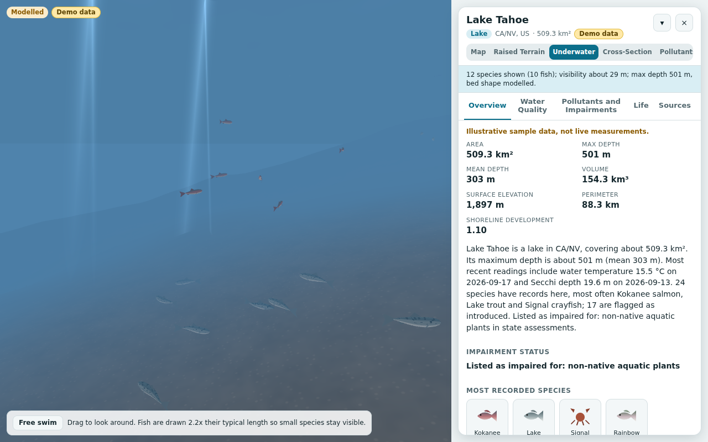

# Water Inspector

A browser app built around a 3D map. Click a lake, river, reservoir, bay or pond and the app shows
hydrography, water quality, impairment and biodiversity data for it, then lets you switch between
four data-driven 3D scenes: raised terrain diorama, underwater view, water-column cross-section and
pollutant view. See [SPEC.md](SPEC.md) for the full product and technical spec.



> Every number you see in demo mode is **illustrative sample data, not live measurements**. The
> fixtures were written for this repo, are marked `"_demo": true`, and the UI labels them as such.
> The app shows data and published screening references for context only. It never says that water
> is safe to swim in or fish is safe to eat.

## Layout

```
app/       Vite + React 19 + Tailwind client (MapLibre map, Inspector panel, R3F scenes)
server/    Hono proxy, one adapter per upstream source, cache, demo mode
shared/    Types, thresholds, units, species catalog, scene model, bathymetry synthesis
fixtures/  Demo-mode sample data (every file carries "_demo": true)
scripts/   Fixture generator
e2e/       Playwright end-to-end tests (run in demo mode)
docs/      Screenshots produced by the e2e suite
```

## Requirements

Node 22+ and npm 10+.

## Run locally

```bash
npm install

# Development: API server on :8787 (demo mode) and Vite on :5173
npm run dev
# open http://localhost:5173

# Same, but with no third-party tile requests (plain local map style, flat terrain)
VITE_OFFLINE_TILES=1 npm run dev

# Or: build the client and serve everything from one origin on :8787 (demo mode)
npm run start:demo
# open http://localhost:8787
```

Demo mode (`DEMO_MODE=1` for the server, `VITE_DEMO=1` for the client) reads bundled fixtures
instead of the network. It is the default for `npm run dev` and `npm run start:demo`.

Live mode: `npm run build && npm start` (no `DEMO_MODE`) serves the real adapters. Live mode needs
outbound access to the hosts in `server/src/config.ts`; it could not be exercised from the build
container, see Status below.

### Environment variables

| Variable             | Where  | Meaning                                                                         |
| -------------------- | ------ | ------------------------------------------------------------------------------- |
| `DEMO_MODE`          | server | `1` reads `/fixtures` instead of calling upstream APIs                          |
| `PORT`               | server | Listen port, default 8787                                                       |
| `ATTAINS_API_KEY`    | server | Free api.data.gov key for EPA ATTAINS (falls back to `DEMO_KEY` with a warning) |
| `CACHE_DIR`          | server | On-disk JSON cache directory (default `server/.cache`, live mode only)          |
| `DEPTH_INDEX_PATH`   | server | Lake depth index built by `build-lake-depth-index.ts` (live mode)               |
| `FIXTURES_DIR`       | server | Override the fixtures folder                                                    |
| `VITE_DEMO`          | app    | `1` shows the demo banner and enables the demo outlines and markers             |
| `VITE_OFFLINE_TILES` | app    | `1` swaps the basemap and DEM for a minimal local style (no tile requests)      |
| `VITE_MAP_STYLE_URL` | app    | Override the basemap style URL (default: built-in USGS satellite style)         |
| `VITE_DEM_URL`       | app    | Override the Terrarium DEM tile URL template for map terrain                    |

All upstream base URLs, layer names, TTLs, concurrency limits and timeouts live in
`server/src/config.ts` so they can be corrected without touching adapter code.

## Scripts

```bash
npm run lint        # ESLint + Prettier check
npm run typecheck   # tsc in every workspace, plus scripts/ and e2e/
npm test            # Vitest unit tests in every workspace
npm run test:e2e    # Playwright e2e in demo mode (builds the client, starts the server)
npm run fixtures    # regenerate fixtures/ from scripts/generate-fixtures.ts
npx tsx shared/scripts/build-species-catalog.ts   # regenerate shared/species-catalog.json
npx tsx server/scripts/build-lake-depth-index.ts --hydrolakes X.shp --globathy Y.csv --out server/data/lake-depth-index.json
```

The e2e suite uses Chromium from `PLAYWRIGHT_BROWSERS_PATH` (override with `CHROMIUM_PATH`) and
software WebGL (SwiftShader), so it needs no GPU and no network. It writes one screenshot per view to
`docs/screenshots/`.

## How it fits together

```
Browser (app)
  MapLibre map  --click-->  selection store (waterbody id) + URL (?wb=&view=&tab=&sp=)
  Inspector     <-- TanStack Query --> /api/*  (one query per section, each with its own skeleton/error)
  R3F scenes    <-- SceneModel, a pure function of the loaded sections (shared/src/sceneModel.ts)

Server (Hono)
  /api/waterbody/at?lat&lon   identity + geometry (NHD, OpenStreetMap fallback)
  /api/waterbody/:id          identity
  /api/waterbody/:id/profile  full WaterbodyProfile, adapters in parallel, 8 s timeout each
  /api/waterbody/:id/{physical,quality,life,impairments,stations}
  /api/waterbody/:id/dem      elevation grid for the diorama (fixture in demo, Terrarium tiles live)
  /api/search?q               place search (Nominatim, 1 request per second)
  Adapters -> normalizers -> shared types; cache = in-memory LRU + optional JSON files, TTL per source
```

- The client never calls a data API directly. Only basemap and terrain tiles come from third parties.
- Every adapter returns `SourceResult<T>` with status, data, source, URL (keys redacted) and time.
- The Sources tab lists every provenance. Estimated values are labelled as estimates; bathymetry is
  always labelled "Modelled" because it is synthesised from max and mean depth, not surveyed.
- Thresholds (`shared/src/thresholds.ts`) carry citation URLs and are used for colour coding only.

## Status

All six milestones from SPEC section 15 are built: scaffold, types and fixtures, server adapters,
map and Inspector, the four 3D views, and the polish pass (accessibility, reduced motion, e2e tests,
screenshots, 152-species catalog). What follows is what is incomplete or differs from the spec, and
why.

Verified here: lint, typecheck, 237 unit tests (shared 85, server 94, app 58) and 27 Playwright e2e
tests in demo mode, with software WebGL. Screenshots of every view are in `docs/screenshots/`.

Not verified, because the data hosts and tile servers are unreachable from the build container:

- **Live mode against the real services.** Every adapter builds the request shapes documented in the
  spec and is unit tested against fixtures written in the shapes I expect back. The response shapes
  of EPA ATTAINS (`assessments`), USGS NAS, the USGS OGC `latest-continuous` collection, the WQP beta
  (WQX 3.0) path and GBIF are my best reading of the docs and have not been checked against the
  live APIs. Field names, layer names and base URLs are in `server/src/config.ts` and the
  normalizers. Expect to adjust them on first contact.
- **Basemap, terrain tiles and hover highlighting on the OpenFreeMap style.** The code path exists
  (queries the style's `water` layers) but only the offline style and demo outlines were exercised.
- **Frame rate.** There is no GPU here, so the 60 fps target with 250 fish is untested. The scene is
  built for it (one `InstancedMesh` per species, animation in the vertex shader, CPU work limited to
  the boid update and 250 matrices) and drops pixel ratio, particles and fish counts through drei
  `PerformanceMonitor` below 45 fps. Initial JS for the map shell is about 376 KB gzipped (the
  three.js scenes and the Inspector are split out).

Deviations from the spec

- **Fixtures are illustrative.** Outlines are hand-drawn approximations scaled to roughly the real
  surface areas. Depths are rounded published-magnitude values, water quality and species counts are
  generated from seeded random series, station ids, GBIF keys and HydroLAKES ids are synthetic
  (`DEMO-...`, `nhd:demo-...`). Nothing here is a measurement.
- **Elevation grid for the diorama comes from the server** (`/api/waterbody/:id/dem`): a fixture in
  demo mode, Terrarium tiles decoded server-side with `pngjs` in live mode. The decode and stitching
  code is shared. The map's own terrain still requests tiles directly from the browser.
- **Underwater patch** is a 200 m x 200 m transect from the shoreline shelf toward deeper water
  following the lake's depth profile, so the littoral shelf is always visible, rather than a patch
  at the deepest point. Fog is rendered with at least 2.2 m of visibility so very turbid water stays
  readable (the true value is in the text alternative). Fish are drawn at 2.2x their typical length.
- **Cross-section** draws the deepest water across the width at each position along the longest
  axis (a thalweg profile), which stays inside the water for curved lakes, instead of a literal
  straight slice. The vertical exaggeration is printed in the legend.
- **GBIF**: species details are fetched for the 60 most recorded species and "last observed" only
  for the top 12, to keep a cold request inside the 8 s budget. The plant group also queries
  Haloragaceae, Ceratophyllaceae and Lythraceae so common invasives (milfoil, water chestnut) appear.
  Mammals are limited to Cetacea and Sirenia as the spec lists, so beaver and otter records are not
  queried.
- **USGS OGC** uses only `latest-continuous` (merged into the water quality section as near-real-time
  values). Monitoring station lists come from the Water Quality Portal.
- **State** comes from the NHD record when present (the demo fixtures include it) and otherwise from
  a Nominatim reverse lookup; **HUC8** from the NHD record or a WBD point query.
- **Additive type fields**: `ParameterSummary.{note, depthProfile, depthProfileDate,
latestByStation}`, `ThresholdRef.{hardLimit, note}`, `SpeciesRecord.{family, order, taxClass}`,
  `WaterbodyProfile.sources`, `SourceResult.extras`, `CatalogSpecies.{group, family, iucn}` and a few
  `SceneModel` fields (`origin`, `pollutantDetails`, `listedImpairments`, `plantCount`, ...). Section
  endpoints (`/physical`, `/stations`, `/dem`, identity by id) are extras to the spec's route list.
- **IUCN categories** in the catalog are best effort and unverified; thresholds that I could not
  confirm carry a `// verify` comment in `shared/src/thresholds.ts`.
- **maplibre-gl** stays on 5.x as the spec asks. `npm audit` reports an advisory against it
  (`DOM.sanitize` XSS bypass) whose fix is in 6.x; the app never passes untrusted HTML to popups or
  markers. Upgrading to 6.x is untested.
- **Not done**: the spec's non-goals and later-version ideas (accounts, saved lists, Canada and EU
  coverage, fish consumption advisories, the seasonal time slider), and a real lake depth index (the
  build script exists and is unit tested, but the HydroLAKES and GLOBathy files are not in the repo,
  so live mode estimates depth from terrain until you build one).
